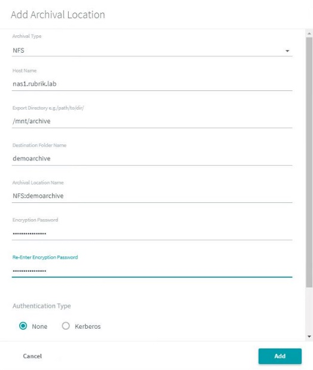
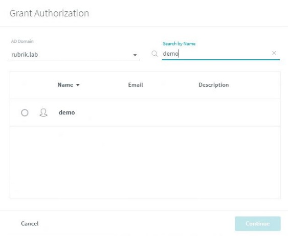
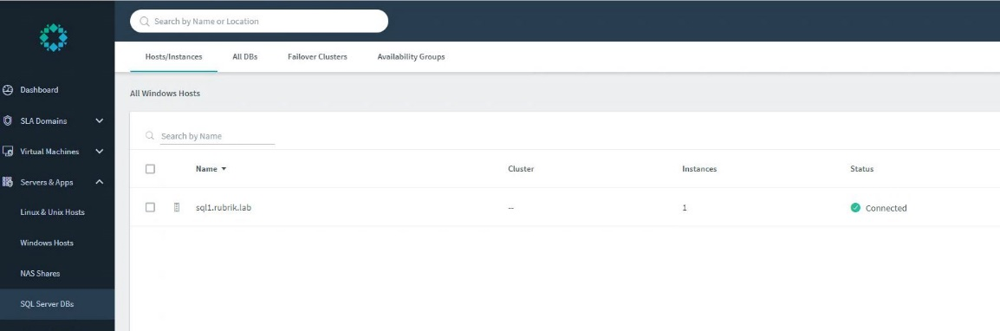

# 

# Project Oasis Demo Service

# Foundations Lab Guide

v.Draft6 5/10/2018

**Lab Selection and Use Cases**

Lab Topology

{width="7.7972222222222225in" height="3.377083333333333in"}

**Lab Entry Desktop Jumpbox Server Login**

User: **demo@rubrik.lab**

Password: **Welcome10!**

{width="5.256944444444445in" height="0.3819444444444444in"}Use the Resources Menu below to access the Credentials used in this Lab.

# Table of Contents

# Introduction

# [Task 1: Dashboard Walkthrough](#task-1-dashboard-walkthrough) {#task-1-dashboard-walkthrough .TOC1}

# [Task 2: Connecting to the Local Infrastructure](#task-2-connecting-to-the-local-infrastructure) {#task-2-connecting-to-the-local-infrastructure .TOC1}

### Task 2a: Configure Local Timezone

### Task 2b: Connect to the vCenter Server

### Task 2c: Setup an NFS Archive Location

### Task 2d: Setup AD integration and Authorize a user

### Task 2e: Install the Rubrik Backup Service on the Windows Host

### Task 2f: Add the Windows Host (connect to the Backup Service) 

### Task 2g: Bootstrap the Second Rubrik (optional)

### Task 2h. Replication Setup

### Task 2i. Setting up replication using a Static Address]

# [Task 3: SLA Domains](#task-3-sla-domains) {#task-3-sla-domains .TOC1}

### Task 3a: Create an SLA Domain

### Task 3b: Apply an SLA Domain to a VMware Virtual Machine

### Task 3c. Apply an SLA Domain to a SQL Server Database

### Task 3d. Apply an SLA Domain to NAS Share and Fileset

# [Task 4: Recovery](#task-4-recovery) {#task-4-recovery .TOC1}

### Task 4a. Windows VM File Level Recovery

### Task 4b. VM Recovery Live Mount

### Other Topics: Unmanaged Objects

### Task 4c. SQLServer Live Mount

# [Task 5: Reporting](#task-5-reporting) {#task-5-reporting .TOC1}

### Task 5a. Envision

### Task 5b. Activities & Notifications

# [Task 6: Rubrik API](#task-6-rubrik-api) {#task-6-rubrik-api .TOC1}

Task 6a. API Documentation and Playground

Task 6b. Example Use Cases

# [Task 7: Rubrik API PowerShell examples](#task-7-rubrik-api-powershell-examples) {#task-7-rubrik-api-powershell-examples .TOC1}

### Task 7a. PowerShell: VMware Virtual Machine Live mount and unmount

### Task 7b. PowerShell: SQL Live mount and Unmount

### Task 7c. PowerShell: SQL OnDemand Snapshot

### Task 7d. PowerShell: NodeMonitoring

# [Appendix 1: Lab Infrastructure Specifics](#appendix-1-lab-infrastructure-specifics) {#appendix-1-lab-infrastructure-specifics .TOC1}

# Introduction

Rubrik's simple user interface is built on a RESTful API-driven framework with an HTML5 web user interface (UI). In Task 1 you will become familiar with the Rubrik Dashboard, in Task 2 you will connect to local resources and in task 3 you will configure **SLA Domains** to backup the local resources.

# Task 1: Dashboard Walkthrough

## [Return to the Table of Contents] (#table-of-contents) {#table-of-contents}

In this task you become familiar with the layout of the Rubrik Dashboard.

1.  To start the lab environment, click on the link in the emailed Rubrik Lab invitation or get access information from your lab facilitator.

2.  You may be presented with more than one Virtual Machine. Click on the VM named Jump1 in the portal interface.

3.  Login to the Windows desktop using the following credentials:

    a.  Username: **demo@rubrik.lab**

    b.  Password: **Welcome10!**

> Anytime Credentials are used in the lab, you can use the Resources Menu in the interface to copy/paste credentials into the Console.

4.  From the Windows desktop, launch the Chrome browser.

5.  At the top of the browser window you will find a series of bookmarks. Click on the Rubrik bookmark to launch the Rubrik UI.

6.  If you receive a message stating, "Your connection is not private"

    c.  Click the **ADVANCED** link located at the bottom of the page

    d.  Click **Proceed to \[your ip address\]** located at the bottom of the page

7.  Log in to the UI using the following credentials:

    e.  Username: **admin**

    f.  Password: **Welcome10!Rubrik**

The Resources Menu in the interface can be used to cut and paste Usernames and Passwords.

8.  Once authenticated, the Rubrik UI will default to the Dashboard page.

    g.  Locate the **vSphere VMs** pane. This section provides a high-level overview of how many objects are protected by an SLA Domain. By default the Vsphere VMs are displayed.

    h.  The **SLA Domains** pane rovides an overview of each SLA Domain and how many objects are being protected.

    i.  The **Activity** pane lists all currently and recently completed tasks.

    j.  In the middle of the Dashboard, you can see the number of active Live Mounts as well as the number of Incoming Snapshots.

    k.  The **System** pane displays the number of Briks configured in the cluster and the number of nodes.

    l.  Next to the System pane the number of snapshots residing on this Rubrik cluster, percent data reduction using deduplication and compression, and amount of data archived is displayed.

<!-- -->

6.  From the **System** pane, click on the **See more** link. This section details the specs of the Rubrik cluster as well as some performance details.

# Task 2: Connecting to the Local Infrastructure

## [Return to the Table of Contents] (#table-of-contents) {#table-of-contents}

In this task you will perform several initial setup items to connect to the local infrastructure.  NOTE: skip if running a preconfigured lab

Task 2a: Configure Timezone

Task 2b: Connect to a VMware VCenter Server

Task 2c: Connect to an NFS Archive location

Task 2d: Connect to an AD Server to integrate Rubrik Login authentication then

Task 2e: Install the Rubrik Backup Service on the Windows Host

Task 2f: Add the Windows Host (connect to the Backup Service)

Task 2g: Bootstrap a Replication Cluster Rubrik and Setup Replication (Optional)

Task 2h: Replication Setup

## Task 2a: Configure Local Timezone

1.  If you are not at the top of the UI, scroll to the top and then click on the settings icon {width="0.33055555555555555in" height="0.2696981627296588in"}.

2.  Select **Cluster Settings** from the **System Configuration** section of the menu.

3.  Click the drop-down menu in the Cluster Time Zone section and then select **Americas/Los Angeles**.

4.  Click **Update**.

> All other servers in the lab are set to this timezone. Cluster location can be set to your preference or left at n/a. *A future version of the lab will set all servers to the timezone that the lab is running in*.
>
> {width="6.5in" height="1.7624562554680665in"}

a.  Select **Continue** when the confirmation window is displayed.

## Task 2b: Connect to the vCenter Server 

1.  From the top of the UI, click on the settings icon {width="0.33055555555555555in" height="0.2696981627296588in"}.

2.  Select **vCenter Servers** from the **Application Configuration** section of the menu.

<!-- -->

5.  The Virtual Infrastructure page appears. Click the blue **+** icon. The Add vCenter dialog box appears.

{width="2.923611111111111in" height="2.118056649168854in"}

6.  In vCenter IP, type the resolvable hostname or IPv4 address of the vCenter Server: **vc1.rubrik.lab**

7.  This vCenter is integrated with AD. In the vCenter login type:

> Username: **demo@rubrik.lab**
>
> Password: **Welcome10!**

8.  Click the **Add** Button in the bottom left corner.

> The Rubrik cluster tests the connection and saves the information.
>
> {width="3.556515748031496in" height="2.0902766841644795in"}

9.  Verify that **vc1.rubrik.lab** has a status of Connected.

10. Select **Virtual Machines** -&gt; **vSphere VMs** from the menu on the left. Verify that three VMs from the VMware environment have been discovered.

{width="7.558333333333334in" height="2.290277777777778in"}

## Task 2c: Setup an NFS Archive Location

1.  If you are not already logged in to the Rubrik UI, login using the following credentials:

    a.  Username: **admin **

    b.  Password: **Welcome10!Rubrik**

2.  From the top of the UI, click on the settings icon {width="0.33055555555555555in" height="0.2696981627296588in"}.

3.  Select **Archival Locations** found in the **System Configuration** section of the menu.

<!-- -->

3.  In the upper right-hand corner, click the blue **+** icon.

4.  The Add Archival Location window opens. By default, the Archival type is set to Amazon S3. The lab environment utilizes an NFS server, so the Archival Type will need to be changed to NFS. Complete the Add Archival Location using the following:

    a.  Archival Type: click the dropdown menu icon and select **NFS**.

    b.  Host Name: **nas1.rubrik.lab**

    c.  Export Directory: **/mnt/archive**

    d.  Destination Folder Name: **demoarchive**

> The Archival Location Name is constructed for you as "NFS:&lt;destination folder name&gt;".

e.  Encryption Password: **Welcome10!Rubrik**

f.  Re-Enter Encryption Password: **Welcome10!Rubrik**

g.  {width="3.5034722222222223in" height="4.142361111111111in"}Authentication Type: leave default

<!-- -->

5.  Select **Add** in the lower left corner.

6.  {width="2.004166666666667in" height="2.4833333333333334in"}Verify archival location is added in the Archival Locations pane.

## Task 2d: Setup AD integration and Authorize a user.

1.  If you are not already logged in to the Rubrik UI, login using the following credentials:

    a.  User: **admin **

    b.  Password: **Welcome10!Rubrik**

2.  From the top of the UI, click on the settings icon {width="0.33055555555555555in" height="0.2696981627296588in"}.

3.  **Access Management** section of the menu.

4.  Click the **Connect AD Domain** Button.

> {width="4.574711286089239in" height="2.9569444444444444in"}

5.  The Connect AD Domain window is displayed. Enter the following:

    c.  Domain Name: **rubrik.lab**

    d.  Username: **Administrator**

    e.  Password: **Welcome10!**

6.  Click **Connect** in the bottom right corner of the Connect AD Domain window.

> {width="2.4444444444444446in" height="2.325in"}

7.  Verify the **Users and Groups** tab is selected and then click **Grant Authorization**.

    {width="6.5in" height="1.8645833333333333in"}

8.  Using the pull-down AD Domain menu, find and select **rubrik.lab**.

9.  In the "Search by Name" area, type in **demo**.

    {width="2.7708333333333335in" height="2.2777777777777777in"}

10. Select the **demo** radio button and then click **Continue**.

11. When the Manage Role screen is displayed, select **Administrator**.

12. {width="3.85in" height="2.602777777777778in"}Click **Assign** in the bottom right corner.

13. Click on the user icon {width="1.1636614173228346in" height="0.25648075240594925in"} and select **Sign Out**.

14. Login using the credentials you just created: Click on **Sign In**

> Username: **demo@rubrik.lab**
>
> Password: **Welcome10!**

## Task 2e: Install the Rubrik Backup Service on the Windows Host

{width="2.1704319772528433in" height="2.053940288713911in"}

**Background:**

The Rubrik Backup Service provides the Rubrik cluster with the ability to manage SQL Server databases on Windows Server hosts, as well as physical Windows and Linux workloads, or backup Linux and Windows running virtually at a more granular level than via a VM level backup.

The Rubrik Backup Service software can be downloaded directly from the Rubrik cluster, or the software can be downloaded once and copied to Windows Server hosts as needed.

<table>
<tbody>
<tr class="odd">
<td>
Explanations:

The Rubrik Backup Service software can only be used with the Rubrik cluster from which the software is obtained. Each Rubrik cluster generates a copy of the Rubrik Backup Service software that includes authentication and encryption information specific to that Rubrik cluster. This method ensures that the Rubrik cluster and a hosted deployment of the Rubrik Backup Service can reliably authenticate each other and encrypt data-in-flight.
</td>
</tr>
</tbody>
</table>

Rubrik provides automatic upgrades of the Rubrik Backup Service software as part of a general upgrade of the Rubrik cluster software via an outer core/inner core design. After upgrading the Rubrik cluster software, the Rubrik cluster automatically upgrades the Rubrik Backup Service software on all protected Windows Server hosts. Upgrades do NOT require a Windows reboot or a SQL Server restart.

The Rubrik Backup Service must run as an account that is a member of the Administrators group of the Windows Server host.

When first installed, the Rubrik Backup Service runs as a Local System account. A Local System account includes the permissions that are provided by the local Administrators group.

Instead of running the Rubrik Backup Service as a Local System account, the Rubrik Backup Service can be configured to run as a member of the local Administrators group.

To run as a member of the local Administrators group, run the Rubrik Backup Service as a user account that is one of the following:

-   Local user account that is a member of the local Administrators group

-   Domain user account that is a member of the local Administrators group

The installer can be found by attempting to add a Windows and then clicking the Rubrik Backup Service hyperlink in the dialog box.

1.  Install the Rubrik Backup Service on the Windows Server (running SQLServer). Open the Window Server using the **MS SQL Server** Icon on the left of the screen.

    a.  You may receive an Unknown Publisher message, click **Connect**.

    b.  It may take up to 30 seconds for the connection and login to occur.

2.  {width="3.513888888888889in" height="0.75625in"}Open Chrome and select the Rubrik Bookmark on the Bookmark bar.

3.  You may receive an error message that your connection is not private.

    c.  Click the **ADVANCED** link at the bottom of the message.

    d.  Click the **Proceed to \[IP address\] (unsafe)** link.

4.  Login to the Rubrik System using the following credentials:

    e.  Username: **admin**

    f.  Password: **Welcome10!Rubrik**

5.  Click **Servers & Apps** from the menu on the left and the click on **Windows Hosts** from the submenu.

{width="4.475123578302712in" height="2.1333333333333333in"}

6.  Under the heading **No Windows hosts available**, click the **Rubrik Backup Service** Highlighted Link in step 1. This will download the Zipped Package in Chrome's download location.

    g.  Note: you may need to scroll the browser window to find the downloaded zip file.

{width="2.2604166666666665in" height="0.4791666666666667in"}

7.  Open the **RubrikBackupService.zip** file and **extract** it to the download folder or some other location. (do not run it from within the Zip archive).

> {width="4.088888888888889in" height="1.4277777777777778in"}

7.  Double Click the **Rubrik Backup Service** executable.

    a.  When prompted, click **Run**.

    b.  When prompted, click **Next**.

    c.  Click the checkbox to accept the license agreement and then click **Next.**

    d.  Click the **Typical** option.

    e.  Click **Install**.

    f.  When prompted if you would like to allow the app from an unknown publisher to make changes select **Yes**.

    g.  Click **Finish**.

8.  Open the **Services Program**. (tagged to the Task bar, as 2 Gears)

> {width="3.6074070428696414in" height="0.5494728783902012in"}

9.  Locate and right click on the **Rubrik Backup Service** and select **Properties.**

{width="6.082608267716536in" height="1.884569116360455in"}

10. Select the **Log On** tab and then click the **This Account** radio button.

11. Enter the following:

> Username: **demo@rubrik.lab**
>
> Password: **Welcome10!**
>
> Confirm password: **Welcome10!**

h.  Click **Apply. **

i.  At the confirmation screens click **OK**.

j.  {width="3.301388888888889in" height="3.798611111111111in"}Click **OK** on the Rubrik Backup Service Properties window.

<!-- -->

12. Right click on the **Rubrik Backup Service** and select **Restart. **

13. Close the Services window and any open Windows Explorer windows.

## Task 2f: Add the Windows Host (connect to the Backup Service).

1.  Using the Menu on the Left, select "**Servers & Apps**", followed by "**Windows Hosts**"

{width="4.281472003499562in" height="2.063888888888889in"}

2.  Click the **Add Windows Hosts** selection at the bottom center of the screen.

3.  Type in the FQDN of the SQLServer in the lab: **sql1.rubrik.lab** and click the **Add** button in the lower right corner.

> {width="4.362962598425197in" height="2.1176213910761157in"}

4.  Verify the server shows as connected.

> {width="6.5in" height="1.4958333333333333in"}

##  Task 2g: Bootstrap the Second Rubrik (optional)

NOTE: The Bootstrap Process can take from 10 to 20 minutes.

This lab contains two Rubrik Appliances. One appliance is preconfigured. It has been bootstrapped with a management IP of 10.0.1.10. Chrome contains a link on the Bookmark Bar for the 1^st^ Rubrik Appliance.

One appliance is not configured and needs to be bootstrapped. This can be a standalone operation or the Rubrik can be used to setup Replication between two Rubrik systems.

1.  Using the browser log in to the Esx Server. The IP address is **https://10.0.1.22**. Login is "**root**" and the password is "**Welcome10!**"

2.  Expand the hierarchical tree of "Virtual Machines", select the Rubrik Edge virtual machine named "RubrikReplication".

3.  Power on the "RubrikReplication" virtual machine. If the you are asked to answer "If you moved it or copied it", select the default.

4.  Open a Console in the browser, by clicking on the Console Window.

5.  Click in the Console window. The focus of the keyboard input changes to the Console session.

6.  Once the system boots, At the login prompt, log in to the CLI using

> Username: **admin**
>
> Password: **rubrik**

7.  The Rubrik CLI prompt appears.

8.  At the Rubrik CLI prompt, type "bootstrap". The User Configuration section appears.

9.  The lab does not use E-mail notifications. In E-mail, type a dummy email address like **nomail\@rubrik.lab** and press Enter.

10. In Password, type a secure password for the admin account and press Enter. Recommend using **Welcome10!Rubrik** as the admin account password to stay consistent in the lab.

> *Note: The password entered in this step replaces the temporary password for the admin account. If you change the password, Retain the new password in a secure location.*

11. In Re-enter Password, retype the password and press Enter from the previous step.

The Cluster configuration section appears.

1.  In Cluster name, type a name for the Rubrik Appliance. Rubrik identifies itself using this name, in the Rubrik web UI and with other Rubrik clusters. Chose a name like "**demo2**" and press Enter.

2.  In DNS Nameservers, it accepts a comma-separated list of multiple IPv4 addresses of DNS servers. In this case the Lab has one DNS Server. Type **10.0.1.2** press Enter.

3.  In DNS Search Domains, it accepts a comma-separated list of multiple search domains. Type **rubrik.lab** and press Enter

4.  In NTP Servers, type a comma-separated list of NTP servers. Take the default value, **pool.ntp.org**, the virtual cluster of timeservers provide for public use by the NTP Pool Project, and press Enter.

5.  In Management Gateway, type the IP address assigned to the management network gateway. Type **10.0.1.1** and press Enter.

6.  In Management Subnet Mask, type the subnet mask for the management network. Type **255.255.255.0** and press Enter.

7.  In Management VLAN (optional): hit enter (default, no VLAN).

The Node Configuration section appears.

1.  {width="7.66875in" height="2.2708333333333335in"}{width="4.5125in" height="2.6805555555555554in"}In Management IP, type the IP address assigned to the management network interface of Rubrik Edge. Type **10.0.1.12** and Press Enter**.**

The Rubrik CLI starts the system set up process. The Bootstrap Progress section appears and the CLI displays progress messages.

The Rubrik Edge is ready to use within this lab as a replication target.

1.  The "Proceed?" (y,n) \[y\] prompt is presented, press **Enter** or "**y**" to continue.

The bootstrap process continues. (this could take 10 to 20 minutes).

{width="4.611805555555556in" height="1.7347222222222223in"}Bootstrap and system setup is complete. The system requires Registration.

2.  Do not continue with Registration in the Console window. Close down any Console screens.

3.  Using the Chrome Browser login to the Bootstrapped Rubrik System using the Management IP Address: **https://10.0.1.12**

4.  Login to the Rubrik system using the credentials that you setup during Bootstrap.

> Username: **Admin**
>
> Password: **Windows10!Rubrik**

  Click I Agree to accept the EULA. Enter the support Portal Email. Insert these by using the Resources Menu in the lab interface.

{width="6.156944444444444in" height="2.65625in"}

## Task 2h. Replication Setup

NOTE: This section requires that task 2g has been completed

A Rubrik cluster can replicate data to other Rubrik clusters. To use a Rubrik cluster as a replication target, the source Rubrik cluster must be provided with information about the target.

A Rubrik cluster can have multiple target Rubrik clusters. An SLA Domain on the Rubrik cluster can be set up to use any of one of the available targets.

After at least one target Rubrik cluster is successfully set up, the source Rubrik cluster makes replication policy settings available for local SLA Domains.

This Section contains the following task:

##  Task 2i. Setting up replication using a Static Address

1.  Login in to the web UI on the Rubrik Cluster at **10.0.1.10** or select the Bookmark named **Rubrik** on the Chrome Bookmarks Bar.

2.  Click on the top bar of the web UI. {width="0.30625in" height="0.3in"}

3.  From the Settings menu, select **Manage Replication**.

4.  Click the blue + icon. The **Add Remote Cluster** dialog is shown.

{width="4.48536198600175in" height="3.219332895888014in"}

5.  Select Private Network.

6.  Enter the IP Address you used during the Bootstrap process in Task LINK HERE: **10.0.1.12**

7.  Enter the login credentials: "**admin**". Use the password you used in the Bootstrap process in Section H. "**Welcome10!Rubrik**" . Use the Resources Menu on the interface to paste credentials.

8.  Select **Add**.

After a successful test, the source Rubrik cluster adds the replication relationship.

# Task 3: SLA Domains

## [Return to the Table of Contents] (#table-of-contents) {#table-of-contents}

The SLA Domain unifies data protection policies under a single policy engine. It provides a configurable set of policies that can be applied to all objects protected by Rubrik, whether groups of virtual machines, applications, or hosts to achieve specific data protection objectives.

The SLA Domains feature represents an easy-to-configure container for data protection policies. The following table provides an overview of those policies.

This Section includes the following tasks:

Task 3a: Create an SLA Domain with Optional Replication

> Note: Replication requires the initialization (Bootstrap) of a Second Rubrik System. See Task 2g, 2h and 2i.

Task 3b: Apply an SLA Domain to a VMware Virtual Machine

Task 3c: Apply an SLA Domain to a SQL Server Database

Task 3d: Apply an SLA Domain to NAS Share and Fileset

|                                             |                                                                                                                                                          |
|---------------------------------------------|----------------------------------------------------------------------------------------------------------------------------------------------------------|
| **Policy**                                  | **Description**                                                                                                                                          |
| Snapshot and backup frequency and retention | Directs the Rubrik cluster when to create point-in-time snapshots and backups of data sources and how long to keep the data.                             |
| Archiving                                   | Directs the Rubrik cluster to move snapshot and backup data to a separate data storage system for long-term retention.                                   |
| Replication (optional)                      | Directs the Rubrik cluster to send replicas of source snapshots and backups to a target Rubrik cluster and defines the maximum time to keep the replica. |

Rubrik provides Gold, Silver, and Bronze default SLA Domains that are ready for immediate use. Custom SLA Domains can be quickly and easily created to meet the data protection and retention requirements of different groups of virtual machines, applications, and file system hosts.

## Task 3a: Create an SLA Domain 

To create a Local SLA Domain:

1.  If you are not already logged in to the Rubrik UI, login using the following credentials:

    a.  User: **admin **

    b.  Password: **Welcome10!Rubrik**

2.  On the left-hand navigation pane, select **SLA Domains &gt; Local Domains**.

<table>
<tbody>
<tr class="odd">
<td>
<strong>Definitions:</strong>

<strong>Local Domain</strong> - an SLA Domain that is created on the local Rubrik cluster.

<strong>Remote Domain</strong> - an SLA Domain that was created on a Rubrik cluster other than the local Rubrik cluster. Remote SLA Domains appear on a local Rubrik cluster when the local Rubrik cluster is a replication target.
</td>
</tr>
</tbody>
</table>

2.  In the upper right-hand corner, click the {width="0.27697069116360457in" height="0.26018372703412074in"} icon.

<!-- -->

3.  The Create SLA Domain window is displayed use the following to complete the form:

    a.  **SLA Domain Name:** Demo1Hr,  or name of your choosing.

> You may enter any acceptable Domain Name, but "Demo1Hr" will be referenced throughout this lab guide. A best practice would be for this name to describe in summary the contents of the SLA.

b.  **Service Level Agreement -&gt; Snapshot -&gt; Take Snapshots:** In this example and based on the short-term nature of this lab exercise, choose a minimum of taking a Snapshot every 1 hour. You may fill out the remaining SLA fields as you like.

{width="5.150179352580928in" height="1.9912926509186353in"}

<!-- -->

4.  For this lab, use the default settings for the Snapshot Window.

5.  Select **Configure Remote Settings** and continue to create the SLA Domain.

<!-- -->

6.  Move the **Archival** Slider to the "On" position (changes from grey to blue).

7.  Specify **Retention on Brik** as **30** days. You can drag the slider until it is close to 30 days and then use the arrow keys to make small adjustments.

8.  {width="2.772222222222222in" height="3.0541666666666667in"}Select **NFS** option from the Archival Location drop down menu. Note that the Archive name is appended to the NFS option in the pull-down list.

9.  OPTIONAL -- REQUIRES COMPLETION OF Tasks 2g, 2h and 2i.. Turn on Replication and using the pulldown bar select the configured replication target. Set the slider to some non-zero value or **10** days. ALTERNATIVE, Edit an existing SLA and add Replication after Bootstrap and setting up Replication (Tasks 2g, 2h and 2i).

10. Press the **Create** button.

11. Verify the new local SLA domain is displayed.

## Task 3b: Apply an SLA Domain to a VMware Virtual Machine

Rather than manually creating a policy and applying per workload, an SLA Policy may be applied at a broader level - such as the management server \[vCenter Server, System Center Virtual Machine Manager (SCVMM)\], folder, host, cluster, etc. - or granularly (per object) to achieve specific data protection objectives.

To apply an SLA Domain to a single VMware Virtual Machine, perform the following steps:

1.  In the web UI, on the left-side menu, click **Virtual Machines** &gt; **vSphere VMs**. The vSphere VMs page appears, with the VMs tab selected.

{width="5.315858486439195in" height="2.2576388888888888in"}

2.  Search for your Win2016-vm1 system.

3.  Select the Virtual Machine click **Manage Protection**.

4.  Search for the SLA Domain created in the previous selection.

5.  Click **Submit**.

    a.  The VM will soon update to reflect it is protected by the selected SLA Domain.

## 

## Task 3c. Apply an SLA Domain to a SQL Server Database

In this module you will assign a SLA to a Database Server

1.  Select the Servers **SQL Server DBs** from the Rubrik Menu.

{width="5.238888888888889in" height="1.7340277777777777in"}

2.  Select the **All DBs** from the top menu.

{width="6.5in" height="1.9145833333333333in"}

3.  Select the **Adventureworks** from the list of databases

4.  {width="6.5in" height="1.9479166666666667in"}Select **Manage Protection** from the upper right part of the screen.

5.  Apply the appropriate SLA to the Database, **Demo1Hr** is the suggested SLA to use. Then, click **Submit**.

    {width="4.388888888888889in" height="4.784722222222222in"}

## Task 3d. Apply an SLA Domain to NAS Share and Fileset

In this module you will assign an SLA to a NAS Server / NAS Share (NFS) and define a Fileset to protect.

1.  Select the Servers & Apps -&gt; **NAS Shares** from the Rubrik Menu.

2.  Select **Hosts** from the top left horizontal Menu.

3.  Select the button **Add NAS Host**.

> {width="4.441666666666666in" height="2.0493055555555557in"}

4.  Click Hit **Add** **Host**, then enter nas1.rubrik.lab and hit **Add**.

{width="2.651388888888889in" height="2.640277777777778in"}{width="2.6055555555555556in" height="2.7020833333333334in"}

5.  Select "Shares" in the top left horizontal menu. Hit **Add NAS Share**.

> {width="4.182638888888889in" height="1.9652777777777777in"}

6.  Select the listed host "nas1.rubrik.lab" using the radio button. Hit **Next**.

{width="3.066666666666667in" height="3.125in"}

7.  Select NFS, and as the NFS Path, enter **/mnt/demospace**

8.  Select **Finish**

    {width="3.0631944444444446in" height="2.84375in"}

9.  The following path shows as connected. Next step is adding a NAS Share Fileset.

{width="6.5in" height="1.586111111111111in"}

<table>
<tbody>
<tr class="odd">
<td>
<strong>Definitions:</strong>

<strong>Filesets</strong>

A fileset defines a set of files and folders on a Linux host, a Windows host, or a NAS share. The Rubrik cluster interprets a fileset based on the values provided in the Include, Exclude, and Do Not Exclude fields. The Rubrik cluster applies a set of rules to the values provided in these fields and permits several types of values to be added to the fields. The Rubrik cluster uses the filesets that are assigned to a host or share to determine which data to manage and protect
</td>
</tr>
</tbody>
</table>

10. Select **Filesets** from the top left corner horizontal menu, and select **Add Fileset**

    {width="4.936709317585302in" height="2.2916666666666665in"}

11. Click on **Add Fileset**. This rule applied to this Fileset will save all PDF files in the NFS Share. In this example the Fileset is named "GEO-PDFS". Select **Add**.

> {width="2.7847222222222223in" height="3.5506944444444444in"}

12. Select Shares from the top left hand horizontal menu and select the checkbox next to the share name "/mnt/demospace". .

{width="6.311805555555556in" height="1.2569444444444444in"}

13. {width="6.5in" height="2.0930555555555554in"}Select **Manage Protection**

14. Select the Fileset name that was added in step 11. Select **Next**.

    {width="2.848611111111111in" height="3.1875in"}

15. Select the **Demo1Hr** SLA and select Finish.

{width="3.347916666666667in" height="3.785416666666667in"}

## 

# Task 4: Recovery

## [Return to the Table of Contents] (#table-of-contents) {#table-of-contents}

With Google-like search, Rubrik eliminates the file search complexity inherent in legacy solutions by introducing consumer-grade file search that delivers query results instantly. As the user types the query, Rubrik expedites the query by displaying suggested search results with auto-complete functionality. The user can instantly locate specific versions of files across time and locations for all VMs, applications, and file systems - no matter where the data resides (on-premises or in the cloud).

This section includes the following Tasks:

Task 4a: Windows VM File Level Recovery

Task 4b: VM Recovery Live Mount

Task 4c: SQL Server Live Mount

## Task 4a. Windows VM File Level Recovery

Search the Windows Server virtual machine named Win2016-vm1. As you type, the search completes with the best match. The search pane provides information regarding the object's location (in this case, which vCenter Server) and the SLA Domain applied.

1.  Select the found object.

{width="2.647222222222222in" height="0.6895833333333333in"}{width="2.942361111111111in" height="0.9743055555555555in"}

The Overview pain will give more details about the VM including oldest and latest snapshot information.

On the right-hand side there is a Snapshots calendar view. The next few steps will guide you on your journey to explore this more.

{width="4.602083333333334in" height="2.5972222222222223in"}

2.  Select a date that has a blue dot (indicating there are recoverable points from this day).

> You will see all available snapshots listed. An example screenshot below demonstrates all of the snapshots available from 14 March for the selected VM.

{width="3.0833333333333335in" height="2.847916666666667in"}

3.  Select the ellipses icon (**\...**) next to one of the snapshots.

4.  Click **Browse Files**. Navigate to C:/Users/Demo/Desktop to locate Example.txt.

    a.  {width="2.8743055555555554in" height="3.2875in"}Click on the **C:** Folder, continue clicking on folders **Users**, **demo**, and **Desktop**.

    b.  {width="2.8673611111111112in" height="3.290744750656168in"}Scroll Down and Click on the "Desktop" Folder

    c.  Select the ellipses (\...) for the Example.txt file to see the two options available: **Download or Restore**. Do not choose either at this time.

<table>
<tbody>
<tr class="odd">
<td>
<strong>Definitions:</strong>

<strong>Download</strong> - Rubrik cluster generates download links to use for file level restore (FLR) of files and folders, making it available to download locally to the user’s device.

<strong>Restore</strong> - files and folders restored directly to a guest file system of the protected workload whether a VM, physical server, or NAS share.
</td>
</tr>
</tbody>
</table>

5.  Click **OK** to exit the dialog.

6.  Locate the search engine at the top of the snapshot panel. Type Example.txt and locate the file on the Administrator's desktop.

7.  Select a version of the file (example screenshot below) and select the ellipses (**\...**).

{width="3.3196194225721785in" height="3.3593755468066493in"}

9.  Choose **Download**.

> This may take a few minutes. A notification will appear at the top right informing you that the file is ready to download. Simply click the text notification to download.

{width="3.7493055555555554in" height="2.2395833333333335in"}{width="3.5368055555555555in" height="0.8361111111111111in"}

10. Browse to the Downloads folder to view Example.txt.

## Task 4b. VM Recovery Live Mount

Rubrik radically simplifies the recovery process of VM and file-level recovery.

By serving as an online storage endpoint for VM and SQL Server data during the recovery process, Rubrik eliminates the requirement to transfer data before recovery can begin. A protected VM or SQL Server database can almost immediately be available for recovery thus providing a seemingly magic near zero Recovery Time Objective (RTO).

<table>
<tbody>
<tr class="odd">
<td>
<strong>Definitions: </strong>

<strong>Recovery Time Objective -</strong> defines how long it takes to recover data, which can be a single file or a complete data center. This is sometimes referred to as “how long can you afford to have a system offline?”.

<strong>Instant Recovery</strong> - replaces the source virtual machine with a fully functional point-in-time copy. The Rubrik cluster powers off and renames the source virtual machine and assigns the name of the source virtual machine to the recovered virtual machine. The recovered virtual machine is then powered on and the recovered virtual machine is connected to the source network. The Rubrik cluster is the datastore for the recovered virtual machine until it is Storage vMotioned to another datastore.

<strong>Live Mount</strong> - creates a new virtual machine from a point-in-time copy of the source virtual machine. The recovered virtual machine uses the Rubrik cluster as its datastore until it is Storage vMotioned to another datastore. The Rubrik cluster assigns a new name to the recovered virtual machine and powers it up. The source virtual machine runs in parallel.

<strong>Export</strong> - creates a new virtual machine from a point-in-time copy of the source virtual machine. The datastore of the selected Hyper-V host is the datastore for the recovered virtual machine. The Rubrik cluster assigns a new name to the recovered virtual machine and powers it up.
</td>
</tr>
</tbody>
</table>

To Live Mount a VM:

1.  Using the Win2016-vm1 VM, select a snapshot, an archival snapshot, or a replica.

2.  Open the ellipsis (**\...**) menu for the snapshot or replica.

3.  Click **Mount**.

{width="2.2444444444444445in" height="3.470138888888889in"} The Mount Snapshot dialog box appears.

4.  Select an ESXi host for the virtual machine. In this case we select the esx server where the original copy is not running, **esx2.rubrik.lab.**

5.  Click **Remove virtual network devices**.

> Select this option when networking changes or issues prevent the virtual machine from starting.

6.  Click **Mount**.

> The Rubrik cluster mounts the snapshot on the selected ESXi host with a new name and powers up the virtual machine. During the process, messages about the status appear in the Notifications page. The Rubrik cluster records the final result of the task in the Activity Log.

7.  On the left-side menu, click **Live Mounts** &gt; **vSphere VMs**.

{width="6.297916666666667in" height="1.2479166666666666in"}

8.  Locate your **Windows 2016 VM** machine and wait for its **Status** to change to **Powered On**. This may take about a minute to appear.

9.  Open a new tab in the web browser and navigate to the vSphere Web Client URL.

10. Login using your assigned username and password.

11. Use the search function in the upper right-hand corner to locate your Windows VM in vCenter Server.

{width="6.6090277777777775in" height="2.3541666666666665in"}

12. On the **Summary** tab of the VM, scroll down until you locate the **Related Objects** pane. Notice the **Storage** on which the VM is running. It is recommended to Storage vMotion the VM files to primary storage if it is desired to keep the VM running long-term.

{width="6.152777777777778in" height="3.2715277777777776in"}

13. Switch back to the Rubrik UI, **Live Mounts** &gt; **vSphere VMs**.

14. Locate your Windows VM machine and click the ellipses (**\...**). Click **Unmount** and then **Unmount** again once the dialog appears.

<table>
<tbody>
<tr class="odd">
<td>
<strong>Explanations:</strong>

The Rubrik cluster sets the protection state of the Live Mount recovered virtual machine to Do Not Protect. To protect the new virtual machine, add it to an SLA Domain, or remove the individual assignment of Do Not Protect to permit it to inherit protection.
</td>
</tr>
</tbody>
</table>

What if you could instantiate an environment that looked exactly like production (minus a few hours) automatically through APIs and push code into that environment to test?

With Rubrik, you can. Build isolated environments and leverage the Live Mount feature to instantiate identical environments in moments. You can also test an application upgrade, failure scenario, or other use cases using your backup storage. When you are done, you simply throw it away.

## Other Topics: Unmanaged Objects 

A data object, such as a snapshot or backup, is an unmanaged object when any of the following circumstances is true:

-   Data source is no longer available to the Rubrik cluster.

-   Data source was removed from an SLA Domain and not added to another SLA Domain.

-   Data object was created on-demand and without a retention policy.

-   Data object is a replica that is no longer associated with the replication source.

-   Data object is an archival copy that was retrieved from an archival location.

In each of these cases the data object does not have a retention policy to control the life of the data. Data objects without a retention policy are called unmanaged objects.

For on-demand snapshots, an SLA Domain may be specified when the job is created. The Rubrik cluster manages the on-demand snapshot based on the rules and policies of the assigned SLA Domain. When an SLA Domain is not specified, by selecting Forever when the job is created, the on-demand snapshot or backup is considered an unmanaged object

The Unmanaged Objects page may be used to initiate management tasks for unmanaged objects and consists of two levels: data source level and object level.

The data source level provides information about the virtual machines, applications, and filesets that are the source of the unmanaged object data.

The object level provides information about the individual unmanaged objects of a selected data source.

1.  On the left-side menu, click **Unmanaged Objects**.

The data source level of the Unmanaged Objects page appears.

2.  In the **Name** column, select the name of a data source.

The local host page or Recovery Points card page appears.

Tasks (such as Instant Restore, Live Mount, etc.) may be conducted with the data available through the Snapshots card or Recovery Points card. Please do not conduct any tasks against an Unmanaged Object at this time.

#  

## Task 4c. SQLServer Live Mount

This section is where you will find new ideas and methods that take database recovery to another level. We will introduce you to the SQL Live Mount feature.

SQL Live Mount feature aligns with the core simplicity of the Rubrik platform. SQL Live Mount leverages Rubrik's robust Atlas file system and has algorithms around promoting active blocks into flash for performance.

A SQL Live Mount creates a new database from a point-in-time copy of the source database. The Rubrik cluster provides a Samba share of the new database directly from the Rubrik cluster storage layer.

A Live Mount database can be attached to an SQL Server instance on any Windows Server host that is running the Rubrik Backup Service. Transmissions between the Rubrik cluster and the host of the Live Mount are secured by end-to-end encryption.

Using Live Mount to access a copy of a database can significantly reduce the RTO for the database. However, a Live Mount database should not be used for workloads in excess of ten days.

Use Live Mount to create a new database from a point-in-time copy of a source database.

1.  On the left-side menu, click **Servers & Apps** &gt; **SQL Server DBs**.

The **Hosts/Instances** tab of the **SQL Server DBs** page appears.

2.  Click **All** **DBs**.

The **All DBs** tab appears.

3.  {width="6.5in" height="1.3972222222222221in"}In the **Name** column, search a database (**AdventureWorks**). Alternatively, enter a name in the search field or use the filters at the top left of the list.

> The Local page for the database appears, with the Recovery Points card showing the month view.

4.  On the Recovery Points card, select a day that has a green dot.

> The green dot indicates that at least one successful snapshot was created on that day.

The Recovery Points card displays the Day view.

<table>
<tbody>
<tr class="odd">
<td>
Explanation:

While Rubrik always sends incremental backups of SQL Server databases, the green dot indicates the synthetically created Full to match the assigned policy. The points in time between Fulls are offered for databases in Full Recovery mode via automatically rolling transaction logs. Restoring to a Full (aka blue dot) will be somewhat faster than choosing a point in time in between Fulls due to the time savings of not rolling transaction logs.
</td>
</tr>
</tbody>
</table>

5.  Move the Recovery point slider to select a recovery point.

> To select a snapshot, move the slider to a snapshot indicator or click the snapshot indicator dot. The selected time icon changes.
>
> To select a recovery point other than a snapshot time, move the slider to choose that time. The time appears in the time field and the selected time icon changes. Alternatively, type a specific time into the time field.

6.  Open the ellipsis (**\...**) menu and select **Mount**.

The Mount Database dialog box appears.

{width="3.8281255468066493in" height="3.2798512685914263in"}

7.  In **Name**, select a Windows Server host, and click **Next**. You will automatically see all SQL Servers with the Rubrik connector installed. Alternatively, enter the name of a host in the search field.

{width="3.0229166666666667in" height="2.38125in"}

8.  In **Name**, select a SQL Server instance.

Alternatively, enter the name of an instance in the search field.

9.  In **Live Mount Database Name**, type a name.

{width="3.060416666666667in" height="2.522222222222222in"}

10. Click **Mount**.

The Rubrik cluster shares the Live Mount over the SMB/CIFS protocol and sets the protection state of the new virtual machine to Do Not Protect to ensure the Rubrik cluster does not backup data stored on itself. The Rubrik cluster then mounts the share to the specified Windows Server host and attaches the Live Mount database to the specified SQL Server instance. To view the SQL Live Mount:

11. On the left-side menu of the web UI, click **Live Mounts** &gt; **SQL Server DBs**. The SQL Server DB Live Mounts page appears. Wait until the Status changes to Available. This may take approximately one minute.

{width="6.96722331583552in" height="2.179245406824147in"}

12. Minimize the Browser or expose the desktop.

13. Click on the RDP Icon labelled: **MS SQLServer**. The system logins you in.

14. Microsoft SQL Server Management Studio is pinned to the Task Bar (left of Chrome).

Open Microsoft SQL Server Management Studio.

{width="2.513888888888889in" height="0.9916666666666667in"}

15. Click **Connect** at the login prompt.

16. In the left-hand column, expand the **instance name** &gt; **Databases**.

> The Live Mounted Database should be listed. Minimize the Microsoft SQL Server Management Studio and disconnect from the RDP Session.

{width="3.8229166666666665in" height="3.263888888888889in"}

17. Unminimize the Browser Switch back to the Rubrik UI tab.

18. On the left-side menu of the web UI, click **Live Mounts** &gt; **SQL Server DBs**.

    a.  The SQL Server DB Live Mounts page appears.

19. Open the ellipsis (**\...**) menu next to the entry for your Live Mount database.

<!-- -->

20. Click **Unmount**.

A confirmation message appears.

21. Click **Unmount** once more.

> The Rubrik cluster detaches the database from the SQL Server instance and unmounts the share from the Windows Server host.

<table>
<tbody>
<tr class="odd">
<td>
Where to find more?

Visit the Rubrik website to watch webinars on the topics covered in the lab. You will find webinars for SQL, Oracle, CloudOn, and more!
</td>
</tr>
</tbody>
</table>

#  

# Task 5: Reporting

## [Return to the Table of Contents] (#table-of-contents) {#table-of-contents}

It is important to stay informed and laser-focused on the horizon ahead when protecting your critical data.

Rubrik Envision provides a compass view of your cluster by unlocking fast, actionable insights across a multi-cloud environment for business intelligence at scale. Envision delivers analytics on data management, compliance, and capacity utilization across your entire infrastructure - on-premises, at the edge, and in the cloud. You can instantly create and share rich data visualizations and customized reports to drive your operational efficiencies. You can even build your own dashboards, enable self-service access, and create custom reporting workflows with a responsive, HTML5-based interface and an API-first architecture.

While Envision focuses on custom reporting that is also useful for day to day management, the System, Activities, and Notifications screens provide information specifically useful for day to day management.

## Task 5a. Envision

Rubrik Envision provides customizable data protection reports with valuable information from the Rubrik cluster. Envision gives insight into historical information based on Protection Tasks, SLA Compliance, and System Capacity.

You can explore Envision in two formats:

-   Reports Summary

-   Reports Gallery

In the **Reports Summary** you can view or create individual reports in the Daily Protection Tasks by Status, SLA Compliance, Local Snapshot Storage, System Capacity, or Weekly Protection Tasks by SLA Domain sections. Let's explore that section:

1.  In the Rubrik UI, in the left-hand pane, select **Reports** &gt; **Summary**.

The Protection Tasks Details page appears.

2.  Scroll down to **System Capacity** and you will notice: On Brik, Available Storage, Archived, Average Daily Growth, Across All Replicas, and Estimated Runway.

> One of the most critical details here is the **Estimated Runway** that reports the estimated number of days remaining before additional data storage space is required on the Rubrik cluster. This is a critical metric to have available on any system that leverages data reduction combining incremental forever, deduplication, and compression*. NOTE: The Lab system is a Rubrik system specially configured for demonstration purposes with one node and 256GB Raw Capacity.*
>
> {width="4.75625in" height="2.611111111111111in"}
>
> *Example System Capacity from a Rubrik 4 Node Brik:*
>
> {width="4.666666666666667in" height="2.375in"}

3.  Scroll back up to **Daily Protection Tasks by Status** and click **View Report**.

{width="4.875in" height="2.611111111111111in"}

4.  The **Protection Tasks Details** page appears. Scroll down to where you can **Search by Object Name** and supply dynamic filters.

5.  {width="5.25in" height="2.977777777777778in"}Type **"Win** to search for all objects that have been protected with the word **"Win"** in it.

6.  Now clear the Search Window, and filter by **Object Type** and select the **NAS Fileset** Domain to view.

{width="6.5in" height="2.0305555555555554in"}

7.  Now click **Gallery** on the left-side menu under Reports and the Reports Gallery appears.

8.  Click the **Create Report** button in the right-side top corner. The Create Report dialog appears where you can create your own Custom Report.

{width="4.723958880139983in" height="3.4824048556430447in"}

9.  There are several different combinations of reports that you can create to provide you with useful information such as:

-   *Failure Report - Last 7 Days (You will create this one)*

-   Data Reduction Summary - Last 30 Days

-   Average Job Durations - Last 7 Days

-   System Capacity by Object Type - Last 30 Days

-   *Daily Backup Administrator Report (You will create this one)*

-   Daily DBA Report

10. Select the following items to create a Failure Report - Last 7 Days.

|                    |                                                                       |
|--------------------|-----------------------------------------------------------------------|
| **Report Type**    | **Created from \"Protection Tasks Details\"**                         |
| **Top Left Chart** | **Failed Tasks by SLA Domain**                                        |
| Attributes         | SLA Domain                                                            |
| Measures           | Failed Tasks                                                          |
| Chart Type         | Donut                                                                 |
| **Top Left Chart** | **Failed Tasks by Object Name**                                       |
| Attributes         | Object Name                                                           |
| Measures           | Failed Tasks                                                          |
| Chart Type         | Vertical                                                              |
| **Table**          | **Protection Tasks Details**                                          |
| Attributes         | Task Status, SLA Domain, Task Status Task Type, Location, Object Name |
| Measures           | Start Time, End Time, Duration                                        |
| **Filter**         |                                                                       |
| Date               | Past 7 Days                                                           |
| Task Status        | Failed                                                                |
| SLA Domain         | none                                                                  |
| Object Type        | none                                                                  |
| Location           | none                                                                  |
| Object Name        | none                                                                  |
| Cluster Location   | none                                                                  |
| Task Type          | none                                                                  |

11. Click Finish once the report fields have been populated.

12. Repeat the previous steps and use the following items to create a Daily Backup Administrator Report.

|                     |                                                                                                  |
|---------------------|--------------------------------------------------------------------------------------------------|
| **Report Type**     | **Created from \"Protection Tasks Details\"**                                                    |
| **Top Left Chart**  | **Daily Protection Tasks by Status**                                                             |
| Attributes          | Task Type                                                                                        |
| Measures            | Task Count by Status                                                                             |
| Chart Type          | Stacked Horizontal                                                                               |
| **Top Right Chart** | **Failed Tasks by Object Type**                                                                  |
| Attributes          | Object Name                                                                                      |
| Measures            | Failed Tasks                                                                                     |
| Chart Type          | Vertical                                                                                         |
| **Table**           | **Protection Tasks Details**                                                                     |
| Attributes          | SLA Domain, Task Status, Task Type, Object Name, Object Type                                     |
| Measures            | Start Time, End Time, Duration Data Transferred, Data Stored, Dedupe Ratio, Logical Dedupe Ratio |
| **Filter**          |                                                                                                  |
| Date                | Past 24 hours                                                                                    |
| Task Status         | none                                                                                             |
| SLA Domain          | none                                                                                             |
| Object Type         | none                                                                                             |
| Location            | none                                                                                             |
| Object Name         | none                                                                                             |
| Cluster Location    | none                                                                                             |
| Task Type           | none                                                                                             |

13. Click **Finish** once the report fields have been populated.

## Task 5b. Activities & Notifications

The Activity Log and Notifications is where you can view and monitor the current state of time-sensitive tasks. This is useful to determine success, warning, and failures of any backup or archival related tasks within the cluster.

1.  On the right-side of the top bar (in the Rubrik UI) is the Activity Log world icon.

2.  Click the world icon to see all task related activity in progress and completed on the cluster.

{width="2.1875in" height="0.6938331146106737in"}

3.  Click **See all** and it will take you to a page with only activity details.

4.  {width="6.152777777777778in" height="3.084277121609799in"}For Filter Type, choose **Backup** to view only backup related tasks.

5.  Scroll through and determine any recent warnings or failures that may require your attention.

6.  Take note of the status, name, message, and date / time stamps of any tasks that require further investigation.

7.  On the right-side of the top bar is the "Notifications" bell icon.

8.  Click the bell icon to see all task related notifications on the cluster.

{width="2.8489588801399823in" height="0.8959623797025372in"}

9.  Click **See all** and it will take you to a new page with all of the notifications.

10. Only tasks that may indicate a problem or were manually initiated will be displayed here.

11. Click on a warning or failure notification to provide further details which can be helpful in addressing the underlying issue.

{width="6.5in" height="3.6791666666666667in"}

> Should there be any issues or failures to protect a workload, this would be the place to go to find more information to aid in troubleshooting.

Feel free to explore other options on these screens and trying various searches or filters.

# Task 6: Rubrik API 

## [Return to the Table of Contents] (#table-of-contents) {#table-of-contents}

One exciting change slowly percolating throughout the data center is the use of RESTful (Representational State Transfer) APIs to control operations. Rather than having to learn a large swath of DSL (domain specific languages) for each endpoint, the use of a RESTful architecture means any valid language that can make API calls is available to you and your team. This results in a simpler model for data center architecture and an increase in opportunities for automation and orchestration.

The Rubrik REST API provides a RESTful interface for working with Rubrik clusters and Rubrik Edge virtual appliances. The Rubrik REST API can be used to query, configure, and control nearly all of the operations of the Rubrik software.

Transform APIs into a strategic asset instead of a technical tool. Rubrik's native RESTful APIs allow users to automate the delivery of data management services (apply SLA policies, automate recovery testing plans, etc.) with granular control. Unlike legacy solutions, Rubrik has integrated an API- first architecture from Day 1 and consumes the same APIs published and offered to users ("we drink our own champagne"). Users can quickly start automating services with Rubrik's APIs - at a high level, this means associating an object with a desired end state ("what to use" + "what rules to follow").

## Task 6a. API Documentation and Playground 

To view Rubrik's native API documentation:

1.  Open a new tab in your web browser and use the Bookmark on the Bar in Chrome for Rubrik Rest API Specification.

2.  Browse through the documentation to learn more about Rubrik APIs and how they may be used.

3.  Scroll down to **SLA Domains** &gt; **Retrieving SLA Domains**. Read through this section.

> The documentation provides code snippets and parameters to make it easy for you to learn and use our APIs.
>
> Everything is documented using ReDoc, if you go to a specific URL endpoint, Rubrik will provide out the documentation for the APIs.

4.  Open a new tab in your web browser use the Bookmark on the Bar in Chrome for Rubrik API Explorer.

5.  In the top right-hand corner, click **Authorize**.

{width="6.5in" height="3.9027777777777777in"}

{width="3.7222222222222223in" height="2.861111111111111in"}

6.  Ensure your assigned domain username and password. Click **Authorize**.

7.  Navigate to **/sla\_domain** and click **Show/Hide**. **Click Get list of SLA Domains**.

{width="6.5in" height="1.875in"}

8.  Under **Parameters**, enter a **Value** for name.

9.  Click Try it out!

{width="6.280625546806649in" height="4.026042213473316in"}

10. Notice the **Response Body**. There should be at least one response for Gold. This detail the configuration of queried SLA Domain.

{width="6.5in" height="4.166666666666667in"}

## Task 6b. Example Use Cases

The uses cases with Rubrik's RESTful APIs are unlimited. This section is intended to provide a few examples of what you could do.

**Configuration Management** - Easily plug into config management tools (i.e. Puppet, Chef, Salt, Ansible) to simplify deployments across hundreds of servers or VMs. Tag objects with metadata via the API. Rubrik auto-assigns associated data protection policies when new objects are created.

**Orchestration Management** - Leverage service catalogues to deliver Rubrik-as-a-Service with custom pre-built integrations. Simplify orchestration of daily data management tasks (backup, recovery, and archival) with self-service and get customized analytics built-into your tool of choice.

-   **ServiceNow** - Deploy the Rubrik app from the ServiceNow Store to deliver critical data management functions (automated data protection, self-service le recovery, test/dev, analytics) through items presented in ServiceNow's Service Catalog.

-   **VMware vRealize Orchestrator & Automation** - Perform self-service data management tasks through vRO/vRA. Modify SLA protection policies, create backups on-demand, and instantly recover VMs within the vRealize portal.

**Application and Server Validation** - Instantly provision copies to test restore of data, applications, and entire servers against an orchestration engine with minimal API calls (i.e. build a live mount in one line of code).

**Automated Recovery Testing** - Conduct end-to-end recovery testing in less than three minutes with a simple script. Create a live mount, run tests to validate, and shut down in only a few lines of code. Use any language of your choice or Rubrik's pre-built PowerShell module to get started quickly.

Be sure to check out Rubrik's Github page for more!

# Task 7: Rubrik API PowerShell examples 

## [Return to the Table of Contents] (#table-of-contents) {#table-of-contents}

The scripts are provided as unsupported examples of using the Rubrik API through Powershell Calls. The scripts demonstrate:

-   Live Mount and Unmount of VMware Virtual Machines

-   Live Mount and Unmount of Microsoft SQL Server Databases

-   Performs On-Demand Snapshot of the Microsoft SQL Server Database

-   Reports Status of the Rubrik Cluster Monitoring Script.

On the desktop is a folder called AutomationDemos. Within each folder is a pre-built PowerShell script allowing you to demonstrate automating Rubrik.

{width="4.923611111111111in" height="3.719009186351706in"}

System Setup Prerequisites to Run the Scripts:

vCenter is added to the Rubrik System and VMs listed in the RecoveryPlanA.csv must be assigned to an SLA and have current backups. The Windows Server hosting the SQL Database must be added to the system with the AdventureWorks database assigned to an SLA and being backed up.

## Task 7a. PowerShell: VMware Virtual Machine Live mount and unmount

1.  Open the RubrikRecoveryPlanA.csv file with Notepad and review the contents.

{width="2.701388888888889in" height="2.0826082677165356in"}

2.  Right Click on the RubrikRecoveryPlanv2-Simple-Run.ps1 and select run with PowerShell. Review the run log in the Logs directory. Suggested to view the Live Mount in the Rubrik GUI and/or the VMware Web Client Interface.

3.  Right Click on the RubrikRecoveryPlanv2-Simple-Stop.ps1 and select run with PowerShell.

The Run Script automatically starts VM live mounts based on a CSV list for the CentOS and Ubuntu VMs.

The Blog link is included as a source for the scripts. The Stop Script automatically ends the 2 live mounts.

## Task 7b. PowerShell: SQL Live mount and Unmount

{width="2.4305555555555554in" height="1.7234612860892389in"}

1.  Change the working directory to the SQLLiveMount directory.

2.  Right Click on the RubrikSQLLiveMountv2-Mount.ps1 and select run with PowerShell. Mount performs a SQL live mount of the AdventureWorks database and demonstrates out to automate scale of multiple database mounts. It is suggested to view the SQL Live Mount in the Rubrik GUI and/or the SQL Studio Interface in the sql1.rubrik.lab server.

3.  Right Click on the RubrikSQLLiveMountv2-Unmount.ps1and select run with PowerShell.

## Task 7c. PowerShell: SQL OnDemand Snapshot

{width="3.1180555555555554in" height="2.342205818022747in"}

1.  Change the working directory to the SQLOnDemandSnapshot directory.

2.  Right Click on the RubrikSQLOnDemandSnapshotv1.ps1 and select run with PowerShell. This script demonstrates the ability to take and schedule specific point in time backups for SQL databases by using the AdventureWorks database protected in your Rubrik system, a common ask/requirement from DBAs.

## Task 7d. PowerShell: NodeMonitoring

1.  Change the working directory to the NodeMonitoring directory.

2.  Right Click on the RubrikNodeMonitoringv1.ps1 and select run with PowerShell. This script demonstrates how to query the status of nodes programmatically for disk, node, and cluster status. The example accommodates node failures and allow subsequent actions to be taken; I.E email alerts. Email alerts, syslog, and SNMP can already be configured on a Rubrik cluster.

{width="3.125in" height="2.0062390638670164in"}

#  

# Appendix 1. Lab Infrastructure Specifics

## [Return to the Table of Contents] (#table-of-contents) {#table-of-contents}

The following are the host names, IP addresses and login credentials for the Infrastructure Servers and VMs in the Lab. The VMs (and any new VMs), are setup for DHCP networking in the range of 10.0.1.100 to 10.0.1.254.

<table>
<thead>
<tr class="header">
<th>Server Name</th>
<th>Description</th>
<th>IP Address</th>
<th>Domain Login</th>
<th>Local Login</th>
</tr>
</thead>
<tbody>
<tr class="odd">
<td>Jump1.rubrik.lab</td>
<td>Windows 10 Pro “Jumpbox”</td>
<td>10.0.1.100 static</td>
<td>
demo@rubrik.lab /

Welcome10!
</td>
<td>Demo / Welcome10!</td>
</tr>
<tr class="even">
<td>Rubrik41p1</td>
<td>Rubrik 4.1.0-p1</td>
<td>10.0.1.10</td>
<td>
demo@rubrik.lab /

Welcome10!
</td>
<td>admin / Welcome10!Rubrik</td>
</tr>
<tr class="odd">
<td>ReplicationRubrik</td>
<td>Rubrik 4.1.0-p1</td>
<td>10.0.1.12</td>
<td>
demo@rubrik.lab /

Welcome10!
</td>
<td>admin / Welcome10!Rubrik</td>
</tr>
<tr class="even">
<td>ad1.rubrik.lab</td>
<td>Windows 2012R2 AD Server</td>
<td>10.0.1.2 static</td>
<td>
demo@rubrik.lab /

Welcome10!
</td>
<td>administrator / Welcome10!</td>
</tr>
<tr class="odd">
<td>esxi1.rubrik.lab</td>
<td>ESXi 6.5</td>
<td>10.0.1.20 static</td>
<td>NA</td>
<td>root / Welcome10!</td>
</tr>
<tr class="even">
<td>esxi2.rubrik.lab</td>
<td>ESXi 6.5</td>
<td>10.0.1.30 static</td>
<td>NA</td>
<td>root / Welcome10!</td>
</tr>
<tr class="odd">
<td>nas1.rubrik.lab</td>
<td>FreeNas Server</td>
<td>10.0.1.6 static</td>
<td>NA</td>
<td>root / Welcome10!</td>
</tr>
<tr class="even">
<td>sql1.rubrik.lab</td>
<td>MS SQL Server 2014</td>
<td>10.0.1.7 static</td>
<td>
demo@rubrik.lab /

Welcome10!
</td>
<td>administrator / Welcome10!</td>
</tr>
<tr class="odd">
<td>vc1.rubrik.lab</td>
<td>vCenter 6.5</td>
<td>10.0.1.3 static</td>
<td>
demo@rubrik.lab /

Welcome10!
</td>
<td>administrator@vsphere.local / Welcome10!</td>
</tr>
<tr class="even">
<td>Win2016-vm</td>
<td>Windows 2016 Datacenter on ESXi</td>
<td>10.0.1.x dhcp</td>
<td>
demo@rubrik.lab /

Welcome10!
</td>
<td>administrator / Welcome10!</td>
</tr>
<tr class="odd">
<td>Cents07-vm</td>
<td>Centos 7 Linux on ESXi</td>
<td>10.0.1.x dhcp</td>
<td>NA</td>
<td>root / Welcome10!</td>
</tr>
<tr class="even">
<td>Ubuntu14-vm</td>
<td>Ubuntu 14</td>
<td>10.0.1.x dhcp</td>
<td>NA</td>
<td>demo / Welcome10!</td>
</tr>
</tbody>
</table>
